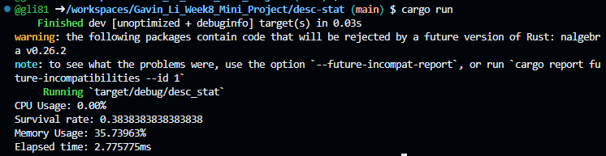
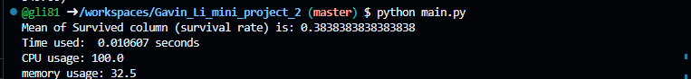
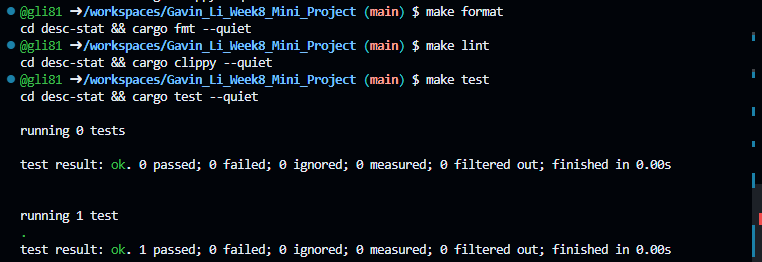

# IDS 706 Data Engineering Week 8 Mini Project

Gavin Li `gl183`

## Purpose of the project

The purpose of this project is to translate a python data processing script into a rust program, and compare the performance of the two.

## Result of the program

## Result of `make format`, `make lint`, `make test`

## Comparison between Python script and Rust program

|| Python | Rust |
|---| --- | --- |
| Time elapsed | 10.61ms | 2.78 ms |
|CPU Usage | 100% | 0% |
| Memory Usage | 32.5% | 35.74% |

As shown in the table, rust takes less time and less CPU usage to perform the same task than python does, while memory usage is about the same.

## References

* [Professor Noah's rust data engineering repo](https://github.com/nogibjj/rust-data-engineering)
